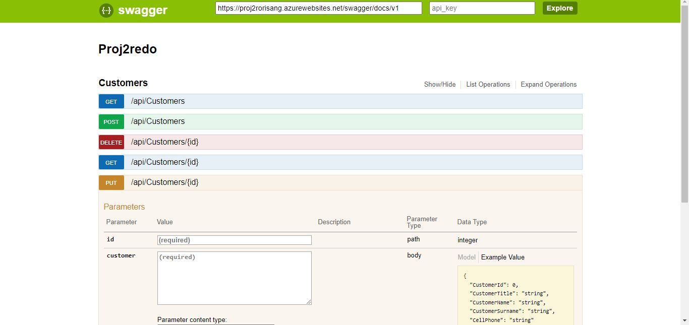

# CMPG323-Project-2
Connection string is missing the password. To run the code from your machine, replace the "PASSWORD-HERE" with the password given.
Security is managed in the backend by allowing only certain endpoint to access the API.

**Note to markers:**
*The first half of this project's version history is located under the CMPG323---overview repo as I misunderstood the instructions.*

This is a bare-bones example of a .NET MVC application providing a REST
API using Swagger UI in the frontend.

## Run the app
The app is accessible on (https://proj2rorisang.azurewebsites.net/swagger/ui/index)

# REST API

The REST API to the example app is described below.

## GET
Click on the table you'd like to get data for and press the "Try it out!" button

## POST
Add the record you'd like to enter into the textbox in JSON format.NB: do not include the primary key as a parameter⸺ it's automatically generated.

## DELETE
Navigate to the delete section, type in the id of the item you'd like to delete and click "Try it out!"

## GET (by id)
Navigate to the GET section that accepts values. Insert the id of the item you'd like returned and click "Try it out!"

## PUT
To update a record, insert it's id and similarr to the POST section, plug in the new data in JSON format and click "Try it out!" to update it.

# References
Microsoft. 2022. Using Web API 2 with Entity Framework 6. https://learn.microsoft.com/en-us/aspnet/web-api/overview/data/using-web-api-with-entity-framework/part-1 Date of access: 27 Aug. 2023.

Henrique Siebert Domareski. 2021. Deploying a .NET 5 Web API and a SQL Database in Azure. https://henriquesd.medium.com/deploying-a-net-5-web-api-and-a-sql-database-in-azure-24e5cae7d6fe Date of access: 27 Aug. 2023.
